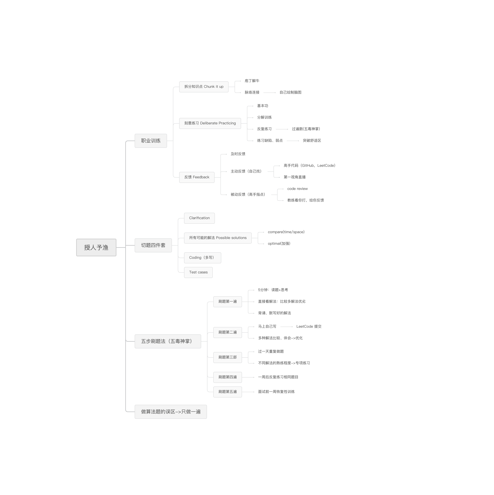
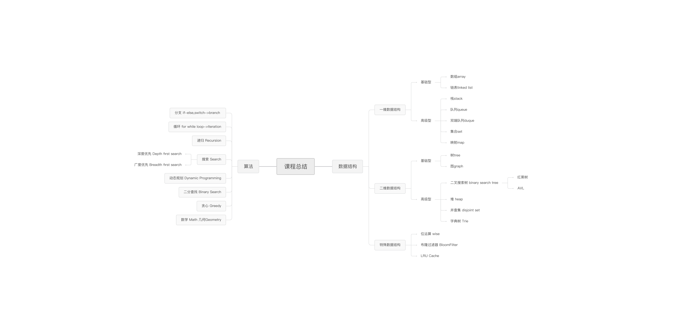

# 极客帮数据结构与算法总结

## 一、数据结构与算法总览

### 1、授人予渔-学习方法脑图



### 2、算法和数据结构脑图



## 二、训练准备和复杂度分析

### 1、训练环境设置、编码技巧和Code Style

#### 1）工具

- google 
- mac:iTerm2+zsh
- windows:microsoft new terminal
- VSCode；IntelliJ;
- LeetCode plugin(VSCode & InteLLiJ)


### 2）方法
* 自顶向下的编程模式、不纠结细节；

* 先解决主干逻辑；

### 2、时间复杂度和空间复杂度分析

#### 1）时间和空间复杂度

* 分析时间和空间复杂度；

* 用最简洁的时间和空间复杂度完成代码；

* 主定理](http://zh.wikipedia.org/wiki/主定理)

#### 2）常见时间复杂度表示(由低到高)

* O(1)：常数复杂度，例如一层循环for(int i=1;i<=n;i++){}
* O(log n)：对数复杂度
* O(n)：线性时间复杂度
* O(n^2)：平方，例如2层for循环
* O(n^3)：立方，例如3层for循环
* O(2^n)：指数，例如费波纳基数列
* o(n!)：阶乘
* 注：只看最高复杂度的运算

#### 4）思考题

1. 二叉树遍历 - 前序、中序、后序：时间复杂度是？O(n)
2. 图的遍历：时间复杂度？O(n)
3. 搜索算法：深度优先（DFS）、广度优先（BFS）时间复杂度？O(n)
4. 二分查找：时间复杂度？Log(n)
5. 排好序的二维矩阵中查找：O(N) 
6. 归并排序：O(NlogN)
7. 费波那奇数列算法

#### 5）疑问

* 时间复杂度的颗粒度：

​		例子1+2+3+……N，方法一：for循环y+=i，方法二用公式：y=n*(n+1)/2

​		上面两种方法不一定第二种方法好，因为第二种用到了乘法和除法，计算机底层加减法比乘除法更快，或底层时间复杂度更低。

* 第二种理解是比如有些高级语言的一个方法就是一句话0(n)，或自己写一个方法。

## 三、数组、链表、跳表

### 1、数组、链表、跳表的基本实现

* 数组、链表、跳表的原理和实现
* 三者的时间复杂度、空间复杂度
  * linkedList时间复杂度
    * prepend O(1)
    * append O(1)
    * <u>lookup O(n)</u>
    * insert O(1)   ？是否需要先查找
    * delete O(1)
  * Array的时间复杂度
    * prepend O(1)
    * append O(1)
    * <u>lookup O(1)</u>
    * <u>insert O(n)</u>
    * <u>delete O(n)</u>
* 工程运用：LRU算法或redis算法
* 跳表：升维思想+空间换时间：
  * redis数据结构：有序集类型、字典
  * Redis跳表介绍：https://redisbook.readthedocs.io/en/latest/internal-datastruct/skiplist.html

### 2、实战题目

* 移动零：https://leetcode-cn.com/problems/move-zeroes/
* 盛水最多的容器：https://leetcode-cn.com/problems/container-with-most-water/
* 爬楼梯：https://leetcode.com/problems/climbing-stairs/
* 3数之和：https://leetcode-cn.com/problems/3sum/ 
* 环形链表：https://leetcode.com/problems/linked-list-cycle/

## 四、栈、队列、优先队列、双端队列

### 1、栈和队列的实现与特性

* Stack 栈
  * 先入后出；添加、删除皆为O(1)，查询O(n)
  * 方法：peek、pop
  * 官方推荐用Deque
  * 源码分析
  * 扩展：实现类
* Queue 队列
  * 先入先出；添加、删除皆为O(1)，查询O(n)
  * 方法：add、remove、element抛异常；offer、poll、peek返回null；
  * 扩展：实现类
* Deque 双端队列(double ended queue)
  * 头和尾都可以出；插入、删除皆是O(1)，查询是O(n)
  * 方法：addFirst、addLast
  * 扩展：实现类
* Priority Queue 优先级队列
  * 插入操作O（1）；取出操作O(logN)按优先级取出
  * 底层数据结构多样，可以是heap、二叉树、Fibonacci堆、红黑树、treap
  * 优先级排序实现Comparator接口
* 作业
  
  * 用 add first 或 add last 这套新的 API 改写 Deque 的代码
  
  * 分析 Queue 和 Priority Queue 的源码
  
    ~~~java
    //Queue 接口
    //继承接口Collection：有集合操作方法如size、isEmpty、contains等
    //继承Iterable可以迭代iterator
    public interface Queue<E> extends Collection<E> {
        /**
         * 添加元素到队列
         */
        boolean add(E e);
    
        /**
         * 添加元素到队列，如果满抛异常
         */
        boolean offer(E e);
    
        /**
         * 移除元素
         */
        E remove();
    
        /**
         * 移除队头元素
         */
        E poll();
    
        /**
         * 查看头部元素，如果为空抛出异常
         */
        E element();
    
        /**
         * 查看头部元素，如果为空返回null
         */
        E peek();
    }
    
    ~~~
  未完待续……

* python栈和队列实现
  * heapq
  * 高性能container库：https://docs.python.org/2/library/collections.html

### 2、实战题目解析：有效的括号、做小栈等问题

## 五、学习感想
```
通过7天的学习，不仅在算法上有了一定眼界，更重要的是在学习方法上得到了很大的启发，另外也需要加强自己的意志力，克服困难按老师方法练习、总结。
```
